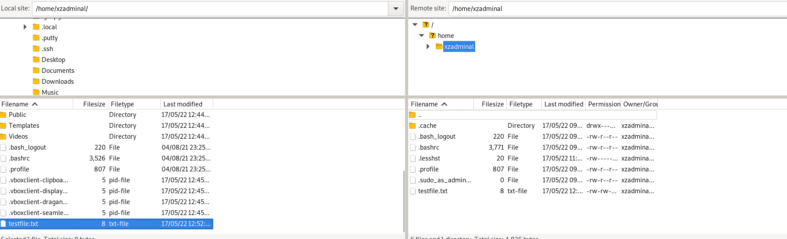

# Linux Configuration Management Final (Installation guide)

Created by: Mikko Pajunen (pajaz)  
Current stage: Alpha

This project is published under GPL-2.0-only (GNU General Public License v2.0).  
https://opensource.org/licenses/gpl-2.0.php   

This document will go through the step by step guide for installation of the module.  

## TLDR (I just want to try it out)

1. Install three or four virtual computers running Debian based Linux on the same network  
    - Tested on 2xDebian 11 Bullseye, 1xUbuntu Server 22.04.   
    - During installation, enable root password and if prompted to make a user, make one but delete after installation.    
2. Install salt-master on one Debian and open firewall ports if necessary  
    - https://docs.saltproject.io/en/latest/topics/tutorials/firewall.html  
    - Currently the apt-repository version offered for Ubuntu is newer than the one for Debian so a manual salt-installation might be in place for the Debian systems (https://repo.saltproject.io/#debian)
3. Install salt-minion on the others, define master and id in /etc/salt/minion -file and restart salt-minion.service  
    - Define firewall settings manually if needed. Ports that need to be open:
      - User Workstation: 22  
      - Web Server: 22, 80
4. Accept the minions' keys on the master: `sudo salt-key -A`   
5. Clone this repository and copy the files in directory 'module' to your salt file root.  
    ```
    $ git clone https://github.com/pajaz/final-module-linux-conf-mgmt2022.git
    $ cd final-module-linux-conf-mgmt2022/
    $ sudo cp -r /module/* /srv/
    ```
6. Run the highstate currently implemented: `sudo salt '*' state.apply`
7. Set up passwords for you users with the [createhash](Scripts/createhash) script and try it out.

Module files [Here](module/)

## Additional Information

Part of Linux Configuration Management ICT4TN022-3015 course of Haaga-Helia University of Applied Sciences held by Tero Karvinen. Course is in Finnish.  

Course page: https://terokarvinen.com/2021/configuration-management-systems-2022-spring/  

## Progress

### Implemented

- Manual Installation stages of User Workstation and Web Server
- Default package states for User Workstation and Web Server
- SSHD configuration for User Workstation and Web Server
  - SSH access for UW set to only allow connections from Admin console C0001  
  - SSH access for WS set to allow connections from anywhere and root access from C0001  
- Browser configuration for User Workstation
  - Blocked installing extensions on Firefox and Chromium
  - Forced installation of uBlock on Firefox and Chromium
- States for admin/user creation for web-server and admin creation for workstations
- Filezilla SFTP configuration with Interactive (always ask for username and password) settings on User Workstations
- ufw manual installation (possibly no automated installation coming)
- Apache2 default index changed and user sites enabled 

### To-Do

- Filezilla to work with private-public key authentication rather than password
- Write down demonstration of salt shadow -module for password management.  

## Devices and user accounts for demonstration 

Devices:  
1 Administrative unit    
1 Web server  
2 User workstations  

Users:  
root, All systems will have root access enabled but admin users will have sudo -rights.  
xzadminal, Ally Administrator, admin (sudo on all devices)  
workewi, Willy Worker, user (regular user on personal workstation and web server)  
smithjo, John Smith, user (regulat user on personal workstation and web server)   
webctrl, user (regular user on the web-server in charge of the company website)   

Systems will run as a Virtual Box instances for the purposes of the demonstration.  

## Administration Unit

Naming: C0001
  
- Operating system: Debian 11 Bullseye Linux
- Desktop Environment: Gnome  
- Memory: 2gb (Enough for the purpose of this test)  
- Disk Space: 15gb (Dynamic)  
- Network adapters: NAT, Host-only Adapter

## Workstation (User)

Naming: U0001 

- Operating system: Debian 11 Bullseye Linux
- Desktop Environment: Gnome  
- Memory: 2gb (Enough for the purpose of this test)  
- Disk Space: 15gb (Dynamic)  
- Network adapter: NAT, Host-only Adapter  

## Webserver 

Naming: S0001

- Operating system: Ubuntu Server 22.04   
- Desktop Environment: No  
- Memory: 2gb (Enough for the purpose of this test)  
- Disk Space: 15gb  
- Network adapter: NAT, Host-only Adapter 

## Administration Unit setup

I started by booting up the Administration Unit for the first time and running the basic apt-get update and upgrade.  
Installed the packages defined in the [Description](Description.md), enabled the firewall (ufw) and allowed connections to the computer through port 22 for ssh. 

```
$ sudo apt-get update
$ sudo apt-get upgrade -y
$ sudo apt-get install ufw openssh-server openssh-client salt-master bash-completion python3 micro git
$ sudo ufw enable
$ sudo ufw allow 22/tcp 
Rules updated
Rules updated (v6)
Firewall is active and enabled on system startup
```

Instead of using the regular apt-repository version this guide will add the saltproject repository to the system and use the latest available version.

Salt-Master installation (latest version) and enabling firewall rules (Firewall rules need to be enabled only on Master (https://docs.saltproject.io/en/latest/topics/tutorials/firewall.html)):
```
# Download key
sudo curl -fsSL -o /usr/share/keyrings/salt-archive-keyring.gpg https://repo.saltproject.io/py3/debian/11/amd64/latest/salt-archive-keyring.gpg
# Create apt sources list file
echo "deb [signed-by=/usr/share/keyrings/salt-archive-keyring.gpg arch=amd64] https://repo.saltproject.io/py3/debian/11/amd64/latest bullseye main" | sudo tee /etc/apt/sources.list.d/salt.list
$ sudo apt-get update
$ sudo apt-get install salt-master
$ sudo mkdir /srv/salt
$ sudo micro /etc/ufw/applications.d/salt.ufw
$ cat /etc/ufw/applications.d/salt.ufw 
# File from https://github.com/saltstack/salt/blob/master/pkg/salt.ufw
# On some operating systems this file is created automatically
# Install into /etc/ufw/applications.d/ and run 'ufw app update salt' to add salt
# firewall rules to systems with UFW.  Activate with 'ufw allow salt'
[Salt]
title=salt
description=fast and powerful configuration management and remote execution
ports=4505,4506/tcp

$ sudo ufw app update salt
$ sudo ufw allow salt
Rule added
Rule added (v6)
```

## User Workstation setup

During installation phase, one user account was created and deleted and the initial configuration was done as root. Rest of the user account management is handled by salt-master.  

Instead of using the regular apt-repository version this guide will add the saltproject repository to the system and use the latest available version.
```
$ deluser disposable
$ rm -r /home/disposable
# Download key
sudo curl -fsSL -o /usr/share/keyrings/salt-archive-keyring.gpg https://repo.saltproject.io/py3/debian/11/amd64/latest/salt-archive-keyring.gpg
# Create apt sources list file
echo "deb [signed-by=/usr/share/keyrings/salt-archive-keyring.gpg arch=amd64] https://repo.saltproject.io/py3/debian/11/amd64/latest bullseye main" | sudo tee /etc/apt/sources.list.d/salt.list
$ apt-get update
$ apt-get upgrade -y
$ apt-get install salt-minion
$ sudoedit /etc/salt/minion

# Following lines changed
master: 192.168.1.5
id: U0001

$ systemctl restart salt-minion.service
$ logout
```

Accepted the key on the Master computer and tested connection:
```
$ sudo salt-key -A
The following keys are going to be accepted:
Unaccepted Keys:
U0001
Proceed? [n/Y] Y
Key for minion U0001 accepted.
$ sudo salt 'U0001' test.ping
U0001:
    True
```

## Web Server setup

During installation one user account was created and deleted. Setup was done as root.    

Initial setup follows the same path as User Workstation wiht the exception that for Ubuntu Server 22.04 the available apt-repository version of salt-minion is already the newest (3004.1 during writing).  

## Package states

This section will go through installing the default packages for Web Server and User Workstations

Created a state called user-packages containing the packages that need to be installed on every user workstation and ran it succesfully:
```
$ pwd
/srv/salt
$ sudo mkdir user-packages
$ cd user-packages/
$ sudo micro init.sls
$ cat init.sls 
user-packages:
  pkg.installed:
    - pkgs:
      - firefox-esr
      - chromium
      - ufw
      - openssh-server
      - openssh-client
      - bash-completion
      - flameshot
      - gedit
      - micro
      - filezilla
      - keepassxc
      - git
      - curl
$ sudo salt 'U0001' state.apply user-packages
# The output is long as so many changes happened, so here's the important parts
Comment: 8 targeted packages were installed/updated.
              The following packages were already installed: firefox-esr, openssh-client, bash-completion, gedit
Summary for U0001
------------
Succeeded: 1 (changed=1)
Failed:    0
------------
Total states run:     1
Total run time:  48.110 s
```

```
$ pwd
/srv/salt
$ sudo mkdir webserver-packages
$ cd webserver-packages/
$ sudo micro init.sls
$ cat init.sls 
webserver-packages:
  pkg.installed:
    - pkgs:
      - apache2  
      - ufw  
      - openssh-server  
      - salt-minion  
      - bash-completion  
      - git
```

## SSHD Configuration

Created a state for handling ssh -connections on the Web Server and User Workstations.

I created the state directory and an .sls file that checks if openssh-server is installed and installs it if necessary:  
```
$ pwd
/srv/salt
$ sudo mkdir sshd
$ cd sshd/
$ sudo micro init.sls
$ cat init.sls
openssh-server:
    pkg.installed
$ sudo salt 'U*' state.apply sshd
```
State was run succesfully
    
I copied the default configuration file /etc/ssh/sshd_config to /srv/salt/sshd, renamed it to [user_sshd_config](module/sshd/user_sshd_config) and added it to managed files: 
```
$ sudo cp /etc/ssh/sshd_config /srv/salt/sshd
$ pwd
/srv/salt
$ sudo mv user_sshd_config
$ sudo micro user_sshd_config
$ sudo micro init.sls 
$ cat init.sls 
openssh-server:
    pkg.installed
/etc/ssh/sshd_config:
    file.managed:
    - source: salt://user_sshd_config
$ sudo salt 'U*' state.apply sshd
```
State was run succesfully.  

Then I added a check to make sure sshd.service is running and set it to restart if the config file changes to apply changes: 
```
$ sudo micro init.sls 
$ cat init.sls 
openssh-server:
    pkg.installed
/etc/ssh/sshd_config:
    file.managed:
    - source: salt://user_sshd_config
sshd:
    service.running:
    - watch:
        - file: /etc/ssh/sshd_config
$ sudo salt 'U*' state.apply sshd
```
State was run succesfully.  

I made an other configuration file for the web-server called [webserver_sshd_config](module/sshd/webserver_sshd_config) and edited the init.sls file to identify the minion and use the correct configuration file accordingly:
```
$ sudo micro init.sls 
$ cat init.sls 
openssh-server:
  pkg.installed
/etc/ssh/sshd_config:
  file.managed:
    
    - source: salt://sshd/user_sshd_config
    
    - source: salt://sshd/webserver_sshd_config
    
sshd:
  service.running:
    - watch:
      - file: /etc/ssh/sshd_config
$ sudo salt '*' state.apply sshd
```
State was run succesfully.  

The regex_match function checks if the minions ID extracted by grains\[id] starts with a specific letter and applies the correct configuration.  

Finally I added the sshd to the [top.sls](module/top.sls) file under base '*' because it can be run for all current minions safely.  

top.sls file at this point:  
```
base:
  '*':
    - sshd
  'U*':
    - user-packages
  'S*':
    - webserver-packages
```

## Browser States (Firefox-esr and Chromium)

Browsers on User workstations are Firefox and Chromium.  
Both browsers will be centrally managed.   
Users will not be able to install extensions to browsers and uBlock adblocker extension will be installed automatically.  

Created the state for Firefox:
```
$ pwd
/srv/salt
$ sudo mkdir firefox
$ sudo cd firefox
$ sudo micro firefox-default-policies.json
$ cat firefox-default-policies.json
{
	"policies": {
  		"BlockAboutConfig": true,
  		"ExtensionSettings": {
  			"*": {
  				"install_sources": ["about:addons", "https://addons.mozilla.org"],
  				"installation_mode": "blocked",
  				"allowed_types": ["extension"]
  			},
  			"uBlock0@raymondhill.net": {
  				"installation_mode": "force_installed",
  			 	"install_url": "https://addons.mozilla.org/firefox/downloads/latest/ublock-origin/latest.xpi"
  			}
  		}
  	}
}
$ sudo micro init.sls
$ cat init.sls
firefox-esr:
  pkg.installed
/etc/firefox/policies/policies.json:
  file.managed:
    - source: salt://firefox/firefox-default-policies.json
    - makedirs: True
$ sudo salt 'U0001' state.apply firefox
```
State ran succesfully. User computer's FireFox has uBlock installed, it can't be removed and new extensions are blocked:


Created a very similar state for Chromium:
```
$ pwd
/srv/salt
$ sudo mkdir chromium
$ sudo cd chromium
$ sudo micro chromium-default-policies.json
$ cat chromium-default-policies.json
{
  "ExtensionSettings": {
    "*": {
      "installation_mode": "blocked"
    },
    "cjpalhdlnbpafiamejdnhcphjbkeiagm": {
    	"installation_mode": "force_installed",
    	"update_url":
    	  "https://clients2.google.com/service/update2/crx"
    }
  }
}
$ sudo micro init.sls
$ cat init.sls
chromium:
  pkg.installed
/etc/chromium/policies/managed/policies.json:
  file.managed:
    - source: salt://chromium/chromium-default-policies.json
    - makedirs: True
$ sudo salt 'U0001' state.apply chromium
```
State ran succesfully. Screenshot from the user workstation:


Browser are now configured correctly.

If you want to know more about the configuration options, look into these links:  
https://support.google.com/chrome/a/answer/7517525#zippy=%2Cset-installation-policies-automatically-install-force-install-allow-or-block  
  - The default path for Chromium differs from Chrome's path. Correct path is /etc/chromium/policies/managed/. The folder has to be created manually.
 
https://github.com/mozilla/policy-templates  

## Filezilla (SFTP)

Goal is for the users to be able move files to their home directory on the webserver (S0001) utilizing SFTP (Secure File Transfer Protocol) running over SSH.  

Haven't set up Filezilla before so configured one computer manually first so I chose File > Site Manager... and New Site and did the following settings:


Then clicked connect and typed in my user name and password for S0001, created a test file to my home directory and moved it to the webserver:



Filezilla configuration files are located in /home/username/.config/filezilla -directory. To be more exact the files needed for setting it up are filezilla.xml and sitemanager.xml. Unfortunately the files are in the user's home folder and and I couldn't find a way to enforce system-wide settings so I'll manage the files through /etc/skel for now to get the correct settings for new users.  
```
$ pwd
/srv/salt/filezilla
$ ls
default-filezilla.xml  default-sitemanager.xml  init.sls
$ cat init.sls 
filezilla:
  pkg.installed

/etc/skel/.config/filezilla/filezilla.xml:
  file.managed:
    - source: salt://filezilla/default-filezilla.xml
    - makedirs: True

/etc/skel/.config/filezilla/sitemanager.xml:
  file.managed:
    - source: salt://filezilla/default-sitemanager.xml
    - makedirs: True
```

The contents of the default -files werecopied from the manual installation computer. That explains choosing the Interactive setting in the Site Manager of Filezilla as it doesn't have any hard-coded paths or usernames and passwords.  

At this point I deleted the user xzadminal from U0001 (deluser xzadminal && rm -r /home/xzadminal), ran the state `sudo salt 'U* state.apply filezilla' succesfully. Created ja new user and tried out Filezilla. Looks to work properly. 

I finally edited the top.sls file:
```
$ cat /srv/salt/top.sls 
base:
  'U*':
    - user-packages
    - filezilla
    - firefox
  'S*':
    - webserver-packages
  '*':
    - sshd
```

Because Filezilla's state manages files that are created for all new users, the state has to be higher than user creation in the top.sls file.  


## User Management

User account management will be automated with following presets:  
- Webserver will have all users present, admin users will have sudo rights.  
- User workstations will have admin accounts with sudo present. The designated user's account will be created manually.   
  - Debian 11 installation forces the creation of a user account. Create one and just remove it immediately with root as the management might get messy with manually created admin accounts.  
- Administrative unit (salt-master) will have admin accounts present but will be configured manually for now.  

Started out by creating a pillar for the users, with separate .sls files for admins and regular users:
```
$ cat /srv/pillar/users/users.sls 
users:
  workewi:
    fullname: Willy Worker
    uid: 2001
    gid: 2001
    other: U0001
  smithjo:
    fullname: John Smith
    uid: 2002
    gid: 2002 
    other: U0002
$ cat /srv/pillar/users/admins.sls 
users:
  xzadminal:
    fullname: Ally Administrator
    uid: 1001
    gid: 1001
    groups:
      - sudo
    other: U0003
$ cat /srv/pillar/users/service.sls
users:
  webctrl:
    fullname: Web-Controller
    uid: 3001
    gid: 3001
$ cat /srv/pillar/top.sls 
base:
  '*':
    - users.admins
    - users.users
  'S*':
    - users.service
```

Next I created the actual salt state that reads from the pillar:
```


# Create user if targets ID starts with S OR if user is in group 'sudo' OR if target computer's ID is the same as user's other field (user's computer) 

{{ username }}:

  group:
    - present
    - name: {{ username }}
    - gid: {{ data.get('gid', '') }}    
  user:
    - present
    - allow_uid_change: True
    - allow_gid_change: True
    - fullname: {{ data.get('fullname', '') }}
    - shell: /bin/bash
    - name: {{ username }}
    - uid: {{ data.get('uid', '') }}
    - gid: {{ data.get('gid', '') }}
    - other: {{ data.get('other', '') }}
    
    - groups:
      
      - {{ group }}
       
      

/home/{{ username }}:
  file.directory:
    - mode: 751



```

And ran the state to all computers with `$ sudo salt '*' state.apply users`. State was run succesfully.  
Also tested the idempotency of the state by deleting (deluser username) the admin account from U0001 and workewi from S0001. The state resolved the issue and recreated the groups and accounts.  


## ufw

For now ufw will be set up manually during installation of a computer/server due to unresolved problems. Often times when installing ufw with salt, minion is out of reach of master for a while (5-15 minutes) or until reboot.  

```
$ sudo apt-get install ufw
$ sudo ufw enable
$ sudo ufw allow 22
$ sudo reboot
```

On the webserver you add to allow access to websites:
```
$ sudo ufw allow 80
```

## Apache 2 Userdirs

Enables user websites at host/~USERNAME   

Settings done according to these instructions: https://terokarvinen.com//2018/apache-user-homepages-automatically-salt-package-file-service-example/

Userdir enabling:
```
$ cat /srv/salt/apache2/init.sls 
apache2:
  pkg.installed
 
/var/www/html/index.html:
  file.managed:
    - source: salt://apache2/default-index.html
   
/etc/apache2/mods-enabled/userdir.conf:
  file.symlink:
    - target: ../mods-available/userdir.conf
   
/etc/apache2/mods-enabled/userdir.load:
  file.symlink:
    - target: ../mods-available/userdir.load
   
apache2service:
  service.running:
    - name: apache2
    - watch:
      - file: /etc/apache2/mods-enabled/userdir.conf
      - file: /etc/apache2/mods-enabled/userdir.load

/etc/skel/public_html/index.html:
  file.managed:
    - source: salt://apache2/user-default-index.html
    - mode: '751'
    - makedirs: True
```

Deleted use xzadminal from U0001, ran the state, ran the users state and set a new password to xzadminal and tested the site. Unfortunately got a Forbidden error so had to adjust the permissions for the whole path:
```
$ chmod ugo+x $HOME $HOME/public_html/; chmod ug+r  $HOME/public_html/index.html
```


Permissions fixed by editing the /etc/skel/public_html/index.html permissions to 754 and user home directories for webserve to "751":
```
$ cat /srv/salt/apache2/init.sls
# Only showing the edited part
/etc/skel/public_html/index.html:
  file.managed:
    - source: salt://apache2/user-default-index.html
    - mode: '754'
    - makedirs: True
$ cat /srv/salt/users/init.sls

/home/{{ username }}:
  file.directory:
    - mode: 751

```

Deleted all the users and home-directories except admin from the webserver S0001 and ran the state `sudo salt 'S*' state.apply`. Multiple users were created and the public_html/index.html now also has correct permissions.


## Apache 2 Index to Dedicated user

Moving the default front-page location from /var/www/ to /home/webctrl/www/ to not require sudo-rights for editing.  

Simple guide for this:  
https://www.digitalocean.com/community/tutorials/how-to-move-an-apache-web-root-to-a-new-location-on-ubuntu-16-04 (Also works on Debian 11)  

On the web-server the file to change is the following:
```
/etc/apache2/sites-enabled/000-default.conf
## Replace this
DocumentRoot /home/webctrl/www/html
## Add these
	<Directory />
		Options FollowSymLinks
		AllowOverride None
	</Directory>
	<Directory /home/webctrl/www/html/>
		Options Indexes FollowSymLinks MultiViews
		AllowOverride None
		Require all granted
	</Directory>
```

And the apache2 state looked like this after the changes:
```
$ cat /srv/salt/apache2/init.sls 
apache2:
  pkg.installed
   
/etc/apache2/mods-enabled/userdir.conf:
  file.symlink:
    - target: ../mods-available/userdir.conf
   
/etc/apache2/mods-enabled/userdir.load:
  file.symlink:
    - target: ../mods-available/userdir.load

# Added the new configuration file
/etc/apache2/sites-enabled/000-default.conf:
  file.managed:
    - source: salt://apache2/000-default.conf

# Changed the path, added makedirs to create parents and set permissions correct
/home/webctrl/www/html/index.html:
  file.managed:
    - source: salt://apache2/default-index.html
    - makedirs: True
    - mode: '754'

apache2service:
  service.running:
    - name: apache2
    - watch:
      - file: /etc/apache2/mods-enabled/userdir.conf
      - file: /etc/apache2/mods-enabled/userdir.load
# Added the conf-file to be watched
      - file: /etc/apache2/sites-enabled/000-default.conf

/etc/skel/public_html/index.html:
  file.managed:
    - source: salt://apache2/user-default-index.html
    - mode: '754'
    - makedirs: True
```

And afer running he states, it works:


Made another user deletion and apache uninstallation on the webserver and ran the states:
```
$ sudo salt 'S*' state.apply
Succeeded: 23 (changed=15)
Failed:     0
```

Everything works, including the websites.  