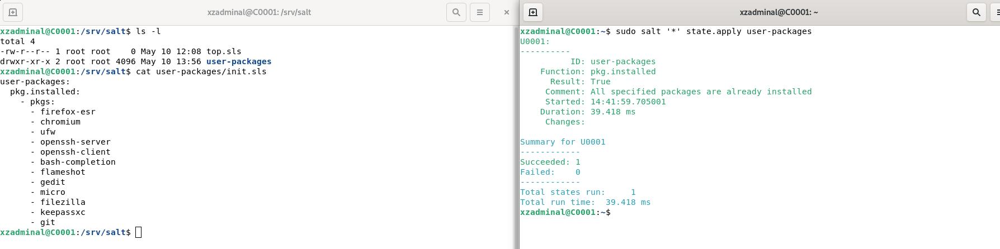

# Salt-stack managed multi-user and server environment

Project created by: Mikko Pajunen (pajaz)  

Salt configuration for a multi-user environment containing personal computers and a server for serving company and (static) user websites.

The implementation will be simulated on VirtualBox virtual computers on a single Linux Debian 11 host. 

## License 

The project is published under GPL-2.0-only (GNU General Public License v2.0).  
https://opensource.org/licenses/gpl-2.0.php   

## Development

Current stage: Alpha
Install Guide/Progress Report [Here](Installation.md)

 

## Additional Information

Part of Linux Configuration Management ICT4TN022-3015 course of Haaga-Helia University of Applied Sciences held by Tero Karvinen.  

Course page: https://terokarvinen.com/2021/configuration-management-systems-2022-spring/  
  
# Project details

This section will provide details of device and user management.  

## Webserver needs

- Serving and managing personal and company websites.
- Keeping personal and company data safe whether in static state or during transfer. 
- SSH/SFTP -access for administration and website deployment.

## User needs

- Building static websites with html/javascrip/css/php and test the functionality locally before deployment.  
- Graphical User Interface
- Deploying the website remotely to server.  
- Keeping personal and company data safe whether in static state or during transfer.  
- Tools for document and spreadsheet creation.  
- Browsing the Internet.  
  
## Device Specifications  

This section will list all the server and workstation types, their specifications and default software.  

- Naming model: 1+4  
    - First letter: Type (A = Administrative user, C = Administration (Control) unit, U = regular user, W = Web-hosting server) 
    - 4 digit series: Serial number starting from 0001
  
### Administration Unit 

Contains the salt-master installation for centralized management of the networked devices.  
SSH and SFTP -access is allowed for admin users for setup and configuration.  
  
Naming: Cxxxx

#### Technical Specifications

- Operating system: Debian 11 Bullseye Linux
- Desktop Environment: Gnome  
- Memory: 2gb (Enough for the purpose of this test)  
- Disk Space: 15gb (Dynamic)  
- Network adapter: NAT, Host-only Adapter

#### Packages  

- ufw  
- openssh-server  
- openssh-client  
- salt-master  
- bash-completion  
- python3  
- micro
- git

### Web Server

Server for hosting company/user websites.  
SSH and SFTP -access is allowed for admin users for setup and configuration.  
SSH and SFTP -access is allowed for regular users for personal website configuring. Access is restricted to user home directory.    

Naming: Sxxxx

#### Technical Specifications

- Operating system: Ubuntu Server 22.04  
- Desktop Environment: No  
- Memory: 2gb (Enough for the purpose of this test)  
- Disk Space: 15gb  
- Network adapter: NAT, Host-only Adapter 

#### Packages  

- apache2  
- ufw  
- openssh-server  
- salt-minion  
- bash-completion  
- git  

#### Updates

System and software updates will be run once a week on Monday morning at 5:00am. 

### Workstations (User)

Naming: Uxxxx 

#### Technical Specifications

- Operating system: Debian 11 Bullseye Linux
- Desktop Environment: Gnome  
- Memory: 2gb (Enough for the purpose of this test)  
- Disk Space: 15gb (Dynamic)  
- Network adapter: NAT, Host-only Adapter 

#### Packages  

- firefox-esr (default in Debian 11)
- chromium
- ufw
- libreoffice (default in Debian 11)
- openssh-server
- openssh-client
- bash-completion
- flameshot
- gedit (default in Debian 11)
- micro
- salt-minion
- filezilla
- keepassxc
- git

#### Updates

System updates will be run on startup.  

### Workstations (admin)

Naming: Axxxx

The basic setup is identical to user workstations but admin users are free to modify the system according to their own needs.  